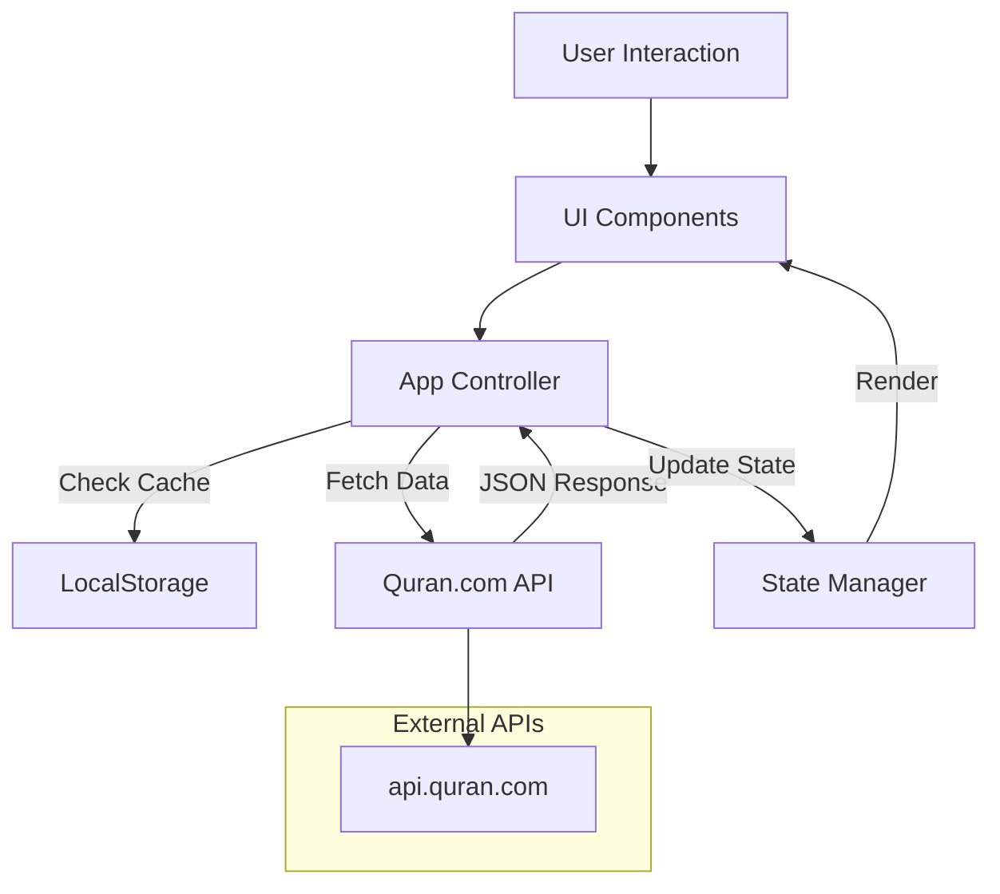

# Quran App Architecture

## 1. System Overview
This application is a Client-Side Single Page Application (SPA) built with Vanilla JavaScript, HTML5, and CSS3 (Tailwind CSS). It interacts with public APIs to fetch Quranic data, audio, and translations.

## 2. File Structure
```
/project-root
├── index.html          # Main application entry point (UI Shell)
├── style.css           # Custom styles & overrides
├── app.js              # Main application logic (API, State, UI)
└── ARCHITECTURE.md     # System documentation
```

## 3. Module Breakdown (Logical)

### A. Data Layer (API Service)
Responsible for fetching data from `api.quran.com/v4`.
- `fetchChapters()`: Get list of 114 Surahs.
- `fetchVerses(chapterId)`: Get Uthmani text for a specific chapter.
- `fetchTranslations(chapterId, resourceId)`: Get translations.
- `fetchTafsir(verseKey, resourceId)`: Get Tafsir text.
- `fetchRecitations()`: Get list of available reciters.
- `getAudioUrl(reciterId, chapterId)`: Construct audio streaming URL.

### B. State Management
Holds the current state of the application.
- `currentSurah`: ID of the currently viewed Surah.
- `currentReciter`: ID of the selected audio reciter.
- `currentTranslation`: ID of the selected language.
- `audioState`: { isPlaying, currentTime, currentAyah }.
- `bookmarks`: Saved verse keys in `localStorage`.

### C. UI Components
- **Sidebar**: Displays list of Surahs and Search bar.
- **Main View**:
  - **Header**: Settings toggle (Translation/Reciter), Bismillah.
  - **Verse Container**: Renders Ayahs, Translation, and Action Buttons (Play, Tafsir, Bookmark).
- **Audio Player**: Fixed bottom bar with Play/Pause, Next/Prev, Progress bar.
- **Modals**: Tafsir view, Settings view.

## 4. Data Flow Diagram



## 5. Key Features Implementation
- **Search**: Filters local Surah list; API call for deep text search.
- **Audio**: Uses HTML5 `Audio` object. Synced with verse highlighting.
- **Persistence**: `localStorage` saves 'lastRead' and user preferences (Reciter/Translation).
